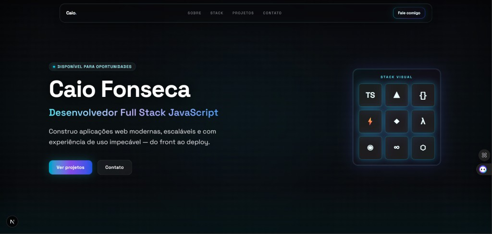

# 🚀 Caio Fonseca Portfolio

Portfólio profissional desenvolvido para apresentar minhas habilidades como desenvolvedor Full Stack JavaScript, com foco em aplicações modernas, performance e experiência visual futurista.



---

## 🧠 Sobre o projeto

Este projeto foi desenvolvido com o objetivo de demonstrar na prática minhas capacidades em desenvolvimento web, desde a construção de interfaces até a integração com serviços e deploy em ambiente real.

A proposta não é apenas estética, mas sim entregar uma aplicação com:
- código limpo
- boa estrutura
- experiência de usuário moderna
- base escalável

---

## ⚙️ Tecnologias utilizadas

- **Next.js (App Router)**
- **TypeScript**
- **Tailwind CSS**
- **Supabase**
- **Google Cloud (APIs e IA)**
- **Vercel (deploy)**

---

## 🎯 Funcionalidades

- Interface moderna e responsiva
- Design futurista com foco em UX
- Animações e transições suaves
- Estrutura baseada em componentes reutilizáveis
- Integração com APIs externas
- Deploy em arquitetura serverless

---

## 🏗️ Arquitetura

- **Frontend:** Next.js (React)
- **Estilização:** Tailwind CSS
- **Backend/DB:** Supabase
- **Infraestrutura:** Vercel + Google Cloud

---

## 🚀 Deploy

🔗 Em breve disponível

---

## 💻 Como rodar o projeto

```bash
npm install
npm run dev